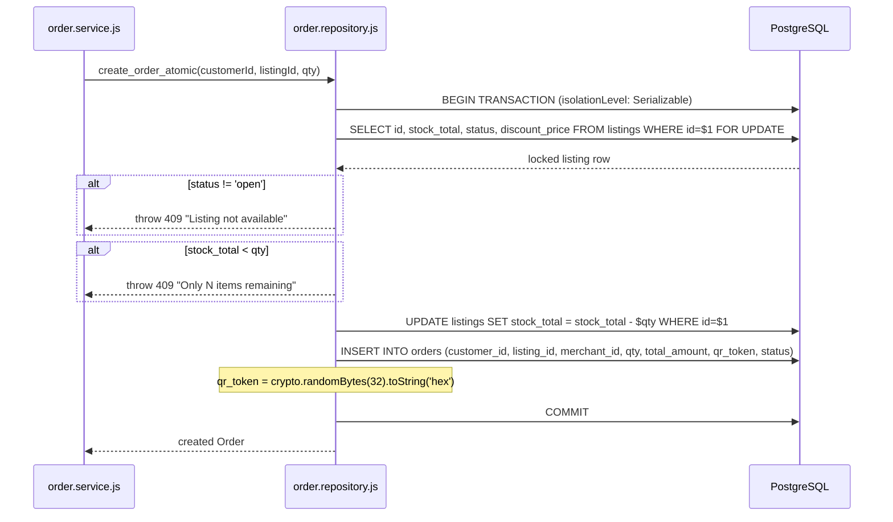
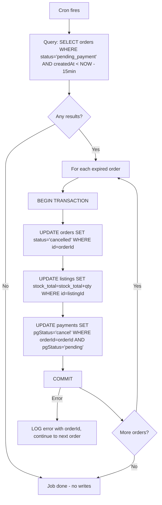

# Design Document — `backend-core-rest-api`

## Overview

SaveBite's `backend-core` is an **Express.js ESM** REST API that serves as the single authoritative backend for the food waste recovery marketplace. It handles three functional domains: **Authentication**, **Listing**, and **Order & Transaction**. The API connects to **PostgreSQL** via **Prisma ORM**, uses **Redis** for optional caching, integrates **Midtrans Snap** for payments, and runs background work through **node-cron**.

This design document describes the complete architecture needed to fix all field-name mismatches in the existing skeleton, implement missing endpoints (QR verification, Midtrans webhook, soft-delete), implement the order timeout cron job, write all validators, and ensure every layer is internally consistent with the Prisma schema as the single source of truth.

**Key design constraint:** The Prisma schema uses camelCase field names in JS (e.g. `fullName`, `stockTotal`, `qrToken`, `customerId`), which map to snake_case columns in PostgreSQL. Any code that uses `full_name`, `stock`, `qr_token`, or `user_id` against Prisma is a bug. Raw SQL must use the lowercase mapped table/column names (`listings`, `orders`, `stock_total`, etc.).

---

## Architecture

### Layer Stack

```
HTTP Request
     │
     ▼
┌─────────────────────────────────────┐
│  Express Router                     │  Route registration, path params
│  src/routes/{domain}/{role}.route.js│
└──────────────┬──────────────────────┘
               │
     ┌─────────▼──────────┐
     │  Middleware Chain   │
     │  authenticate()     │  JWT → req.user
     │  authorize(role)    │  RBAC check
     │  validator[]        │  Input schema guard
     └─────────┬───────────┘
               │
     ┌─────────▼──────────┐
     │  Controller         │  HTTP de/serialization only
     │  asyncHandler(fn)   │  Wraps async, forwards errors
     └─────────┬───────────┘
               │
     ┌─────────▼──────────┐
     │  Service            │  Business logic, domain rules
     └─────────┬───────────┘
               │
     ┌─────────▼──────────┐
     │  Repository         │  Prisma queries + raw SQL
     └─────────┬───────────┘
               │
     ┌─────────▼──────────┐
     │  Prisma Client      │  ORM → PostgreSQL
     └─────────────────────┘
```

### Supporting Infrastructure

```
┌────────────────────────────────────────────────────────┐
│  index.js bootstrap                                    │
│  ├── cors, json, urlencoded middleware                 │
│  ├── Routes: /auth, /listing, /order                   │
│  ├── 404 fallback                                      │
│  ├── globalErrorHandler (last)                         │
│  └── orderTimeoutJob.start()  (node-cron)              │
└────────────────────────────────────────────────────────┘
```

---

## Components and Interfaces

### Auth Module

| File | Role |
|------|------|
| `src/routes/auth.route.js` | Router: POST /auth/reg, /auth/merch_reg, /auth/login |
| `src/controllers/auth.controller.js` | Thin HTTP handlers; uses asyncHandler |
| `src/services/auth.service.js` | register_user, get_token |
| `src/repositories/auth.repository.js` | create_user (with tx), get_acc_by_email |
| `src/validators/auth.validator.js` | Joi/express-validator schemas |

### Listing Module

| File | Role |
|------|------|
| `src/routes/merchant/listing.route.js` | MERCHANT-protected write routes |
| `src/routes/consumer/listing.route.js` | Public read routes |
| `src/controllers/listing.controller.js` | HTTP handlers |
| `src/services/listing.service.js` | Business rules (price validation, soft-delete) |
| `src/repositories/listing.repository.js` | Prisma queries + Haversine raw SQL |
| `src/validators/listing.validator.js` | Body schema validation |

### Order Module

| File | Role |
|------|------|
| `src/routes/consumer/order.route.js` | CUSTOMER order routes + webhook |
| `src/controllers/order.controller.js` | HTTP handlers |
| `src/services/order.service.js` | Order lifecycle: create, verify, cancel |
| `src/repositories/order.repository.js` | Pessimistic lock, atomic ops |
| `src/validators/order.validator.js` | Body schema validation |
| `src/jobs/orderTimeout.job.js` | node-cron: 15-min timeout cancellation |
| `src/events/order.events.js` | EventEmitter domain events |

---

## API Endpoint Table

| Method | Path | Auth | Role(s) | Controller Handler |
|--------|------|------|---------|--------------------|
| POST | `/auth/reg` | ✗ | Public | `register` |
| POST | `/auth/merch_reg` | ✗ | Public | `merchant_register` |
| POST | `/auth/login` | ✗ | Public | `login` |
| GET | `/listing` | ✗ | Public | `get_listings_handler` |
| GET | `/listing/:id` | ✗ | Public | `get_listing_handler` |
| POST | `/listing` | ✓ | MERCHANT | `create_listing_handler` |
| PATCH | `/listing/:id` | ✓ | MERCHANT | `update_listing_handler` |
| DELETE | `/listing/:id` | ✓ | MERCHANT | `delete_listing_handler` |
| POST | `/order` | ✓ | CUSTOMER | `create_order_handler` |
| GET | `/order` | ✓ | CUSTOMER | `get_customer_orders_handler` |
| GET | `/order/:id` | ✓ | CUSTOMER, ADMIN | `get_order_handler` |
| PATCH | `/order/:id/cancel` | ✓ | CUSTOMER, ADMIN | `cancel_order_handler` |
| POST | `/order/:id/verify` | ✓ | MERCHANT | `verify_qr_handler` |
| POST | `/order/webhook/midtrans` | ✗ | Public (sig verified) | `midtrans_webhook_handler` |

> **Note on route ordering:** `POST /order/webhook/midtrans` must be registered **before** `POST /order/:id/verify` in the Express router to prevent the literal string `"webhook"` from matching the `:id` param.

> **Role enum values (Prisma):** `ADMIN`, `MERCHANT`, `CUSTOMER` — the skeleton uses `"CONSUMER"` in several places; this must be corrected to `"CUSTOMER"` everywhere.

---

## Data Models

### Prisma Schema Summary (field names as used in JS)

#### `User` (`@@map("users")`)
```
id          BigInt     @id @default(autoincrement())
fullName    String     @map("full_name")
email       String
password    String
role        Role       (ADMIN | MERCHANT | CUSTOMER)
isSuspended Boolean    @default(false)
createdAt   DateTime
updatedAt   DateTime?
deletedAt   DateTime?
```

#### `Merchant` (`@@map("merchants")`)
```
userId           String @id @db.Uuid   ← NOT linked to User.id via FK
merchantName     String?
latitude         Float?
longitude        Float?
kycStatus        KycStatus?  (pending | approved | rejected)
virtualBalance   Decimal?
address          String?
bankName         String?
bankAccount      String?
...
```
> **Critical:** `Merchant.userId` is a UUID String, while `User.id` is BigInt. They are NOT a real FK in Prisma — the app must generate the merchant UUID server-side with `crypto.randomUUID()`.

#### `Customer` (`@@map("customers")`)
```
userId     String @id @db.Uuid
fullName   String
exp        Int
strikeCount Int
orders     Order[]
```

#### `Listing` (`@@map("listings")`)
```
id               BigInt @id
name             String?
stockTotal       Int       @map("stock_total")
originalPrice    Decimal?  @map("original_price")
discountPrice    Decimal?  @map("discount_price")
status           ListingStatus  (open | close)
deletedAt        DateTime?
merchantId       String? @db.Uuid  @map("merchant_id")
closeTime        DateTime?
...
orders           Order[]
```

#### `Order` (`@@map("orders")`)
```
id           BigInt @id
qty          Int
totalAmount  Decimal    @map("total_amount")
qrToken      String?    @map("qr_token")
status       OrderStatus  (pending_payment | paid | completed | cancelled)
customerId   String @db.Uuid  @map("customer_id")
merchantId   String @db.Uuid  @map("merchant_id")
listingId    BigInt            @map("listing_id")
listing      Listing           ← relation name is "listing", NOT "list"
payments     Payment[]
createdAt    DateTime?
...
```

#### `Payment` (`@@map("payments")`)
```
id            BigInt @id
amount        Decimal?
midtransTrxId String?
pgStatus      PgStatus  (pending | settlement | expire | cancel)
timeLimit     DateTime
orderId       BigInt
customerId    String?
paymentMethod String?
```

### Enum Reference

| Enum | Values |
|------|--------|
| `Role` | `ADMIN`, `MERCHANT`, `CUSTOMER` |
| `OrderStatus` | `pending_payment`, `paid`, `completed`, `cancelled` |
| `ListingStatus` | `open`, `close` |
| `KycStatus` | `pending`, `approved`, `rejected` |
| `PgStatus` | `pending`, `settlement`, `expire`, `cancel` |

---

## Key Algorithms and Flows

### 1. Password Hashing and Verification

`src/lib/hash.js` uses bcrypt with 12 salt rounds (OWASP 2023 minimum).

```
hash_password(plainText) → bcrypt.hash(plainText, 12) → String
verify_password(plainText, hash) → bcrypt.compare(plainText, hash) → Promise<boolean>
```

**Bug in existing code:** `auth.service.js` calls `verify_password(body.password, acc.password_hash)` without `await`. This returns a truthy `Promise` object, so any password passes. The fix is:
1. `await verify_password(body.password, acc.password)` — note `acc.password` not `acc.password_hash` (Prisma field is `password`)
2. If result is `false`, throw `createError("Incorrect email or password", 401)`

### 2. JWT Sign/Verify

`src/lib/jwt.js` uses HS256 with 15-minute TTL.

```
generate_token({ id, email, role, fullName }) → JWT string
verify_token(token) → decoded payload | throws
```

Token payload must use `acc.fullName` (camelCase, matching Prisma field) — not `acc.full_name`.

The `authenticate` middleware decodes the token and attaches the payload to `req.user`:
```
req.user = { id, email, role, fullName }
```

### 3. Pessimistic Lock — Order Creation



**Critical fixes from skeleton:**
- Raw SQL must query `FROM listings` (lowercase mapped table name), **NOT** `FROM "Listing"` (Prisma model name is not the table name after `@@map`)
- Order create data must use camelCase: `customerId`, `listingId`, `merchantId`, `totalAmount`, `qrToken` — NOT `user_id`, `listing_id`, `qr_token`
- `merchantId` must be populated from the locked listing row's `merchant_id` column
- `status` must be `"pending_payment"` (lowercase) — NOT `"PENDING_PAYMENT"`

### 4. Midtrans Webhook Verification

```
POST /order/webhook/midtrans
Body: { order_id, status_code, gross_amount, signature_key, transaction_status, ... }
```

**Signature verification algorithm:**
```javascript
const raw = order_id + status_code + gross_amount + MIDTRANS_SERVER_KEY;
const expected = crypto.createHash('sha512').update(raw).digest('hex');
const match = crypto.timingSafeEqual(
  Buffer.from(expected),
  Buffer.from(signature_key)
);
if (!match) return res.status(403).json({ error: "Invalid signature" });
```

**State machine transitions:**

| `transaction_status` | Order current status | Action | HTTP |
|---------------------|---------------------|--------|------|
| `settlement` / `capture` | `pending_payment` | → `paid` | 200 |
| `settlement` / `capture` | `paid` | No-op (idempotent) | 200 |
| `settlement` / `capture` | other | Reject | 409 |
| `expire` / `cancel` | `pending_payment` | → `cancelled` + restore stock | 200 |
| `expire` / `cancel` | `cancelled` | No-op (idempotent) | 200 |

The route must **not** require JWT authentication — it is called by Midtrans servers.

### 5. QR Verification / Pickup Confirmation

```
POST /order/:id/verify
Auth: MERCHANT JWT
Body: { qrPayload }
```

Flow:
1. `authenticate` → `authorize("MERCHANT")`
2. Validate `qrPayload` format: `/^[a-f0-9]{64}$/`
3. Fetch order by `BigInt(req.params.id)`
4. Check `order.merchantId === req.user.merchantId` → 403 if mismatch
5. Check `order.status === "paid"` → 409 if not `paid`
6. Compare `qrPayload` with `order.qrToken` using constant-time comparison
7. Update `order.status` → `"completed"`
8. Emit `order:completed` event

### 6. Order Timeout Cron Job

```
Schedule: "* * * * *"  (every 1 minute)
```



Each expired order is processed in its own transaction so a single failure does not abort the entire batch.

### 7. Haversine Distance Query

When `?lat=` and `?lng=` are provided to `GET /listing`, the repository executes a raw SQL Haversine query:

```sql
SELECT
  l.id, l.name, l.original_price, l.discount_price, l.stock_total,
  l.status, l.close_time, l.merchant_id,
  m.merchant_name, m.address, m.latitude, m.longitude,
  ( 6371 * acos(
      LEAST(1.0, cos(radians($lat)) * cos(radians(m.latitude::float8))
        * cos(radians(m.longitude::float8) - radians($lng))
        + sin(radians($lat)) * sin(radians(m.latitude::float8)))
  )) AS distance_km
FROM listings l
JOIN merchants m ON m.user_id = l.merchant_id
WHERE
  l.status = 'open'
  AND l.deleted_at IS NULL
  AND l.stock_total > 0
  AND ( 6371 * acos(
      LEAST(1.0, cos(radians($lat)) * cos(radians(m.latitude::float8))
        * cos(radians(m.longitude::float8) - radians($lng))
        + sin(radians($lat)) * sin(radians(m.latitude::float8)))
  )) <= $radius_km
ORDER BY distance_km ASC
```

**Critical fixes from skeleton:**
- Table names must be `listings` and `merchants` (lowercase `@@map` names), not `"Listing"` and `"Merchant"`
- Column names must be the snake_case DB names: `stock_total`, `merchant_name`, `user_id`
- Join condition is `m.user_id = l.merchant_id` (Merchant PK is `user_id`)
- `LEAST(1.0, ...)` guard prevents `acos` domain error on identical coordinates
- Status filter is `'open'` not `'PUBLISHED'`

---

## Error Handling

### `asyncHandler` Wrapper

All async route handlers are wrapped with `asyncHandler(fn)` from `src/middlewares/error.middleware.js`. This eliminates the need for try/catch in every controller:

```javascript
export function asyncHandler(fn) {
  return (req, res, next) => {
    Promise.resolve(fn(req, res, next)).catch(next);
  };
}
```

### `createError` Factory

Services throw operational errors using `createError(message, statusCode)`:

```javascript
export function createError(message, statusCode = 500) {
  const err = new Error(message);
  err.statusCode = statusCode;
  return err;
}
```

### `globalErrorHandler`

Registered last in `index.js`. Handles error types in priority order:

| Error Type | Detection | HTTP Status | Response |
|-----------|-----------|-------------|----------|
| Prisma unique constraint | `err.code === "P2002"` | 409 | `{ error: "Conflict", message: "... already exists" }` |
| Prisma not found | `err.code === "P2025"` | 404 | `{ error: "Not Found", message }` |
| Operational error | `err.statusCode` present | `err.statusCode` | `{ error: err.name, message: err.message }` |
| Unexpected error | fallthrough | 500 | `{ error: "Internal Server Error", message }` (no stack in prod) |

### HTTP Status Code Mapping

| Scenario | Status |
|----------|--------|
| Successful creation | 201 |
| Successful read/update | 200 |
| Missing/invalid input (validator) | 400 |
| Missing/invalid JWT | 401 |
| Wrong role (RBAC) | 403 |
| Resource not found | 404 |
| Duplicate resource | 409 |
| Business rule violation | 409 or 422 |
| Server fault | 500 |

### Validator Error Format

All validators return a consistent shape so the frontend can display field-level errors:

```json
{
  "errors": [
    { "field": "email",    "message": "email is required" },
    { "field": "password", "message": "password is required" }
  ]
}
```

Validators collect **all** errors before returning — they must not short-circuit after the first failure.

---

## File Structure

The following files must be created or modified to satisfy all requirements. Files marked `[FIX]` have bugs in the existing skeleton; files marked `[NEW]` do not yet exist.

```
backend-core/src/
│
├── index.js                                [FIX] Import and start orderTimeoutJob
│
├── config/
│   ├── env.js                              (ok — no changes)
│   └── db.js                              (ok — no changes)
│
├── lib/
│   ├── hash.js                            (ok — no changes)
│   ├── jwt.js                             (ok — no changes)
│   ├── prisma.js                          (ok — singleton)
│   ├── midtrans/
│   │   └── snap.js                        [FIX] Uncomment and implement Snap init
│   └── redis/
│       └── client.js                      (ok — ioredis singleton)
│
├── middlewares/
│   ├── auth.middleware.js                  (ok — no changes)
│   ├── rbac.middleware.js                  [FIX] Fix "CONSUMER" → "CUSTOMER" in docs
│   └── error.middleware.js                 (ok — no changes)
│
├── validators/
│   ├── auth.validator.js                   [NEW] email, password, fullName rules
│   ├── listing.validator.js                [FIX] Implement with express-validator
│   └── order.validator.js                  [FIX] Implement with express-validator
│
├── repositories/
│   ├── auth.repository.js                  [FIX] camelCase fields, return user, UUID gen
│   ├── listing.repository.js               [FIX] camelCase, BigInt coerce, correct SQL
│   └── order.repository.js                 [FIX] camelCase, correct table names, enum values
│
├── services/
│   ├── auth.service.js                     [FIX] await verify_password, camelCase fields
│   ├── listing.service.js                  [FIX] camelCase field names, soft-delete
│   └── order.service.js                    [FIX] "CUSTOMER" role, QR verify logic
│
├── controllers/
│   ├── auth.controller.js                  [FIX] Use asyncHandler, proper status mapping
│   ├── listing.controller.js               [FIX] Add delete handler, asyncHandler
│   └── order.controller.js                 [FIX] Add verify_qr_handler, webhook handler
│
├── routes/
│   ├── auth.route.js                       [FIX] Wrap with asyncHandler + validators
│   ├── consumer/
│   │   ├── listing.route.js                [FIX] Implement public read routes
│   │   └── order.route.js                  [FIX] Fix "CONSUMER"→"CUSTOMER", add routes
│   └── merchant/
│       └── listing.route.js                [FIX] Add DELETE route
│
├── events/
│   └── order.events.js                     [FIX] Register event listeners
│
└── jobs/
    └── orderTimeout.job.js                 [FIX] Implement cron job with node-cron
```

---

## Correctness Properties

*A property is a characteristic or behavior that should hold true across all valid executions of a system — essentially, a formal statement about what the system should do. Properties serve as the bridge between human-readable specifications and machine-verifiable correctness guarantees.*

#### Redundancy Analysis

Before writing properties, the following redundancies were resolved:

- **1.2 and 2.2** (validator completeness for customer and merchant registration) share the same structural pattern — "for any combination of missing fields, exactly one error per missing field is returned". These are combined into **Property 1: Validator completeness**.
- **1.4** (password hashing) and **3.4** (verify_password correctness) are two halves of the same bcrypt round-trip. Combined into **Property 2: Password hash round-trip**.
- **3.6 and 3.7** (JWT payload and algorithm) are both round-trip JWT properties. Combined into **Property 3: JWT round-trip fidelity**.
- **10.6 and 13.3** (cancel atomically restores stock) share the same invariant. Combined into **Property 8: Cancellation atomically restores stock**.
- **12.4 and 12.7** (webhook settlement + idempotency) are combined into **Property 9: Webhook idempotency**.
- **8.4 and 8.5** (order rejection conditions) are combined into **Property 6: Order creation rejection invariant**.

---

### Property 1: Validator Completeness — One Error Per Missing Field

*For any* registration request body (customer or merchant) from which one or more required fields have been removed, the validator SHALL return HTTP 400 and the `errors` array SHALL contain exactly one entry per missing field — no more, no fewer.

**Validates: Requirements 1.2, 2.2, 14.1, 14.2, 14.3, 14.4, 14.5, 15.1, 15.2, 15.3, 15.4**

---

### Property 2: Password Hash Round-Trip

*For any* non-empty string used as a password, `hash_password(password)` SHALL produce a bcrypt hash such that `verify_password(password, hash)` returns `true`, and `verify_password(differentPassword, hash)` returns `false` for any `differentPassword ≠ password`.

**Validates: Requirements 1.4, 3.4**

---

### Property 3: JWT Round-Trip Fidelity

*For any* valid user payload `{ id, email, role, fullName }`, calling `generate_token(payload)` and then `verify_token(token)` SHALL return a decoded object with all original fields preserved, the `alg` header SHALL be `"HS256"`, and the token's `exp - iat` SHALL equal 900 seconds (15 minutes).

**Validates: Requirements 3.6, 3.7**

---

### Property 4: Merchant Transaction Atomicity

*For any* merchant registration input, if the `Merchant` record creation step inside `$transaction` throws an error, then no `User` record SHALL be present in the database after the transaction completes — either both records are created, or neither is.

**Validates: Requirements 2.4**

---

### Property 5: Listing Price Invariant

*For any* listing creation or update request where `discountPrice >= originalPrice`, the system SHALL reject the request with HTTP 422 and no `Listing` record SHALL be written to the database.

**Validates: Requirements 4.4, 6.4**

---

### Property 6: Order Creation Rejection Invariant

*For any* order creation attempt where either (a) the target listing has `status != "open"` or (b) `qty > listing.stockTotal`, the system SHALL return HTTP 409 and the `listings.stock_total` column SHALL remain unchanged after the transaction completes.

**Validates: Requirements 8.4, 8.5**

---

### Property 7: Pessimistic Lock — No Stock Oversell

*For any* listing with initial `stockTotal = N` and `K` concurrent order creation requests each requesting `qty = 1` where `K > N`, the total number of successfully created orders SHALL be at most `N`, and `listings.stock_total` SHALL never go below 0.

**Validates: Requirements 8.3**

---

### Property 8: Cancellation Atomically Restores Stock

*For any* order in `pending_payment` or `paid` status with associated listing stock `S` and `order.qty = Q`, after a successful cancellation (via API cancel or cron timeout), the following invariants SHALL hold simultaneously: `order.status = "cancelled"` AND `listing.stockTotal = S + Q`.

**Validates: Requirements 10.5, 10.6, 13.2, 13.3**

---

### Property 9: Midtrans Webhook Idempotency

*For any* order in `paid` status, sending `N ≥ 2` identical `settlement` webhook callbacks SHALL result in the order remaining in `paid` status after all N calls complete — the status SHALL NOT change, and no duplicate `Payment` records SHALL be created.

**Validates: Requirements 12.2, 12.4, 12.7**

---

### Property 10: Soft-Delete Preserves Record

*For any* listing that has been soft-deleted via `DELETE /listing/:id`, the corresponding `Listing` record SHALL remain retrievable by direct Prisma query with `deletedAt` set to a non-null timestamp, and SHALL NOT appear in any public listing results (`GET /listing` or `GET /listing?lat=&lng=`).

**Validates: Requirements 7.4, 5.1**

---

### Property 11: QR Token Uniqueness and Format

*For any* two distinct order creation events, the generated `qrToken` values SHALL be different, and *for any* single `qrToken`, its value SHALL match the regex `/^[a-f0-9]{64}$/` (64-character lowercase hex string).

**Validates: Requirements 8.9, 15.3**

---

### Property 12: QR Verification Ownership Guard

*For any* (merchant, order) pair where `merchant.userId ≠ order.merchantId`, a `POST /order/:id/verify` request from that merchant SHALL return HTTP 403, regardless of whether the `qrPayload` matches `order.qrToken`.

**Validates: Requirements 9.5**

---

### Property 13: Timeout Job Selectivity

*For any* set of orders with varied `status` values and `createdAt` timestamps, the timeout cron job SHALL update to `cancelled` exactly the orders satisfying both `status = "pending_payment"` AND `createdAt < NOW() - 15 minutes`, and SHALL NOT modify any other orders.

**Validates: Requirements 13.1, 13.2, 13.5**

---

### Property 14: Haversine Result Ordering and Filtering

*For any* `(lat, lng, radius_km)` query to `GET /listing`, all returned listings SHALL have a computed Haversine distance ≤ `radius_km` from `(lat, lng)`, and the results SHALL be ordered by `distance_km ASC` with no gaps or inversions.

**Validates: Requirements 5.2**

---

## Testing Strategy

### Dual Testing Approach

Both unit/example-based tests and property-based tests are needed for comprehensive coverage.

**Unit tests focus on:**
- Specific request/response examples (happy path, known error cases)
- Middleware wiring (asyncHandler delegation, globalErrorHandler HTTP status mapping)
- Enum value correctness (checking `"pending_payment"` not `"PENDING_PAYMENT"`, etc.)
- Integration smoke tests (Prisma $transaction wiring)

**Property tests focus on:**
- Universal invariants that hold across all inputs (Properties 1–14 above)
- Edge cases automatically discovered through input generation

### Property-Based Testing Library

The project uses **Node.js ESM**, so the recommended library is **[fast-check](https://fast-check.dev/)** (works natively with ESM, no additional config):

```bash
npm install --save-dev fast-check vitest
```

Each property test must run a **minimum of 100 iterations** (fast-check default is 100; keep it).

### Test Tag Format

Each property-based test file must include a comment above the test matching:

```
// Feature: backend-core-rest-api, Property N: <property_text>
```

### Example Property Test Structure

```javascript
// Feature: backend-core-rest-api, Property 2: Password hash round-trip
import fc from 'fast-check';
import { hash_password, verify_password } from '../src/lib/hash.js';

test('hash_password produces a hash that verify_password accepts', async () => {
  await fc.assert(
    fc.asyncProperty(
      fc.string({ minLength: 1, maxLength: 72 }),
      fc.string({ minLength: 1, maxLength: 72 }),
      async (password, otherPassword) => {
        fc.pre(password !== otherPassword);
        const hash = await hash_password(password);
        expect(await verify_password(password, hash)).toBe(true);
        expect(await verify_password(otherPassword, hash)).toBe(false);
      }
    ),
    { numRuns: 10 } // bcrypt is slow; 10 runs is sufficient for hash correctness
  );
});
```

### Unit Test Structure

Controllers should be tested with a mocked service layer:

```javascript
// Unit test: auth controller register — success path
import { register } from '../src/controllers/auth.controller.js';
vi.mock('../src/services/auth.service.js');

test('POST /auth/reg returns 201 with user on success', async () => {
  register_user.mockResolvedValue({ id: 1n, email: 'a@b.com', fullName: 'Alice' });
  const { res } = await callHandler(register, { body: { email: 'a@b.com', password: 'pass', fullName: 'Alice' }});
  expect(res.status).toBe(201);
  expect(res.body.user.email).toBe('a@b.com');
});
```

### Test File Layout

```
backend-core/
└── tests/
    ├── unit/
    │   ├── auth.controller.test.js
    │   ├── listing.service.test.js
    │   ├── order.service.test.js
    │   └── error.middleware.test.js
    ├── property/
    │   ├── hash.property.test.js           (Property 2)
    │   ├── jwt.property.test.js            (Property 3)
    │   ├── validator.property.test.js      (Property 1)
    │   ├── listing.property.test.js        (Properties 5, 10, 14)
    │   ├── order.property.test.js          (Properties 6, 7, 8, 11, 12, 13)
    │   ├── webhook.property.test.js        (Property 9)
    │   └── auth.property.test.js           (Property 4)
    └── integration/
        ├── order.integration.test.js       (Pessimistic lock, Property 7)
        └── webhook.integration.test.js     (End-to-end webhook flow)
```

### Notes on PBT Applicability

- **bcrypt** is slow (12 rounds ≈ 100ms each). Property tests for hashing should use `numRuns: 10` instead of 100.
- **JWT properties** (Property 3) use fast in-memory signing — 100 runs is fine.
- **Pessimistic lock** (Property 7) requires real PostgreSQL to test true concurrency. This lives in `integration/` with a test database, not the property folder.
- **Haversine** (Property 14) is a pure mathematical computation — ideal for PBT with 100+ generated coordinate pairs.

---

## Design Decisions and Rationale

### 1. Why `asyncHandler` instead of try/catch in every controller?

DRY principle. A controller that wraps its body in try/catch duplicates error-handling logic. `asyncHandler` centralizes that into one place and guarantees all unhandled rejections reach `globalErrorHandler`.

### 2. Why Serializable isolation for order creation?

`REPEATABLE READ` isolation prevents dirty reads and non-repeatable reads but does **not** prevent phantom reads — a second transaction could INSERT a new row that affects the stock count. `Serializable` prevents phantoms. This is the correct level for stock reservation under concurrent load (NFR-8).

### 3. Why `crypto.timingSafeEqual` for Midtrans signature and QR token comparison?

Lexicographic string comparison (`===`) is vulnerable to timing attacks — an attacker can measure response time to enumerate valid signature prefixes. `crypto.timingSafeEqual` uses constant-time comparison regardless of where the mismatch occurs.

### 4. Why is Merchant.userId a String UUID while User.id is BigInt?

This is an existing schema design decision (likely for multi-tenancy with Supabase Auth). The two are not FK-linked in Prisma. When creating a merchant during registration, the server generates a new UUID with `crypto.randomUUID()` for `Merchant.userId`. This UUID is stored in the JWT payload under `merchantId` so RBAC and ownership checks work correctly.

### 5. Why soft-delete instead of hard-delete for listings?

Historical `Order` records reference `listingId` as a non-nullable FK. Deleting the listing would violate referential integrity. Soft-delete (`deletedAt = new Date()`) preserves the record for audit/display while excluding it from active results via `WHERE deletedAt IS NULL`.

### 6. Why a per-order cron transaction instead of a bulk UPDATE?

A bulk `UPDATE orders SET status='cancelled' WHERE ...` could fail mid-operation, leaving some orders cancelled and their associated `Payment` records in an inconsistent `pending` state. Per-order transactions allow individual error isolation (requirement 13.6) and ensure `Payment.pgStatus` is also updated atomically within the same transaction.

---
