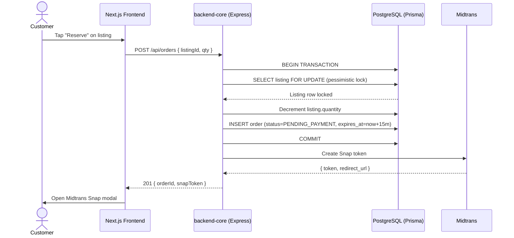
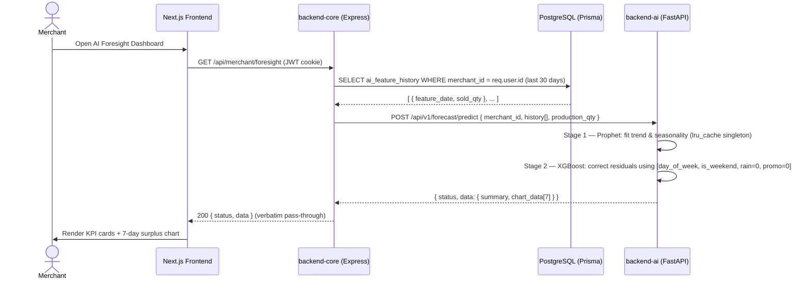
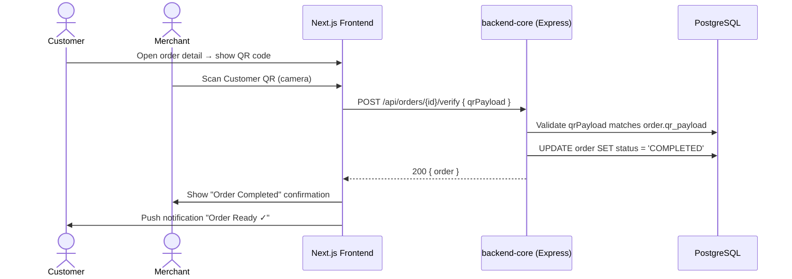

# PRD — SaveBite (Food Waste Recovery Platform)

## 1. Overview
SaveBite adalah platform Progressive Web App (PWA) yang bertujuan untuk menyelamatkan makanan surplus dari UMKM kuliner di Batam. Masalah utama yang diselesaikan adalah inefisiensi distribusi makanan berlebih yang masih layak konsumsi agar tidak berakhir di TPA, sekaligus memberikan fitur kecerdasan buatan (AI Foresight) bagi UMKM untuk memprediksi volume surplus harian.

## 2. Requirements
- **Aksesibilitas:** Berbasis PWA agar ringan, responsif, dan dapat diakses lintas perangkat tanpa instalasi native.
- **Aktor:** Terdapat 3 role utama: Konsumen (Customer), Mitra UMKM (Merchant), dan Administrator.
- **Integrasi Pembayaran:** Wajib menggunakan sistem pembayaran in-app digital via Midtrans Snap.
- **Sistem Cerdas:** Memiliki modul AI yang berjalan di latar belakang untuk melakukan *time-series forecasting* (Prediksi Stok Surplus).

## 3. Core Features (MVP)
1.  **Discovery Berbasis Geolokasi (Konsumen)**
    - Pencarian makanan surplus terdekat menggunakan sinkronisasi koordinat GPS dan Haversine Formula.
2.  **Reservasi & Checkout (Konsumen)**
    - Sistem menerapkan *Pessimistic DB Locking* untuk mencegah *race condition* (pembelian ganda) pada stok terakhir.
    - Timeout 15 menit: Pesanan `PENDING_PAYMENT` yang melewati batas waktu otomatis dibatalkan (Cron Job).
3.  **CRUD Listing Surplus (Merchant)**
    - Pembuatan listing makanan dengan harga coret (diskon). Harga surplus wajib lebih kecil dari harga asli.
4.  **AI Foresight Dashboard (Merchant)**
    - Dasbor analitik yang menampilkan kurva prediksi volume surplus (T+1) untuk mengoptimalkan produksi.
5.  **Verifikasi Pengambilan / Closed-Loop (Merchant & Konsumen)**
    - Merchant memindai payload QR dari Konsumen di lokasi untuk menyelesaikan pesanan (`COMPLETED`).

## 3.1. Functional Requirements (FR)

### 1. Modul Autentikasi & Akun Umum
- **FR-U-01 (Daftar & Login):** Sistem memfasilitasi autentikasi via email/password dengan enkripsi Bcrypt. Kondisi akhir: Menerbitkan JWT Token dan update `device_token` (FCM).
- **FR-U-02 (Logout):** Sistem melakukan penghancuran sesi klien JWT dengan aman. Kondisi akhir: Menghapus `device_token` agar Push Notif berhenti dikirim ke HP yang sudah logout.
- **FR-U-03 (Lupa Sandi):** Sistem memfasilitasi pengiriman link/OTP reset ke email terdaftar. Kondisi akhir: Pengguna dapat menyimpan kata sandi baru.

### 2. Modul Konsumen
- **FR-K-01 (Discovery GPS):** Sistem menampilkan daftar makanan berstatus PUBLISHED yang diurutkan berdasarkan jarak (menggunakan Haversine Formula). Kondisi akhir: Menampilkan *countdown timer* visual di UI aplikasi.
- **FR-K-02 (Checkout Lock):** Sistem mem-booking makanan dengan *Pessimistic DB Locking*. Kondisi akhir: Stok berkurang sementara dan status pesanan menjadi `PENDING_PAYMENT`.
- **FR-K-03 (In-App Payment):** Sistem mengarahkan pengguna ke Midtrans Snap untuk pembayaran. Kondisi akhir: Transaksi otomatis ditolak jika usia sesi checkout > 15 menit.
- **FR-K-04 (Profil & Impact):** Sistem menampilkan form edit identitas dan histori pesanan. Kondisi akhir: Menampilkan dasbor agregat total kg makanan yang diselamatkan dan total uang yang dihemat.

### 3. Modul Merchant
- **FR-M-01 (Kelola Profil):** Sistem menyediakan input koordinat toko (Latitude/Longitude) dan rekening bank. Kondisi akhir: Data harus terisi agar toko bisa tampil di pencarian GPS dan merchant bisa menarik dana.
- **FR-M-02 (CRUD Listing):** Sistem memfasilitasi Create, Read, Update, Soft-Delete penawaran makanan. Kondisi akhir: Batas waktu maksimal 24 jam dan harga diskon (surplus) wajib lebih kecil dari harga normal.
- **FR-M-03 (Scan QR Pickup):** Kamera PWA merchant dapat membaca *payload* QR Konsumen di lokasi. Kondisi akhir: Jika QR valid & status pesanan sesuai (`PAID_RESERVED`), pesanan berubah menjadi `COMPLETED`.
- **FR-M-04 (Ledger & Tarik Dana):** Sistem memfasilitasi pengajuan penarikan dana (Withdrawal) ke rekening asli. Kondisi akhir: Pencairan diizinkan hanya jika saldo virtual merchant >= Rp50.000.

### 4. Modul Admin
- **FR-A-01 (Verifikasi KYC):** Sistem memfasilitasi persetujuan pendaftaran UMKM di platform SaveBite. Kondisi akhir: Merubah status akun dari `PENDING` ke `APPROVED` agar merchant bisa berjualan.
- **FR-A-02 (Proses Payout):** Admin mentransfer uang secara manual dan mengunggah bukti transfer. Kondisi akhir: Menandai antrean penarikan dana (WITHDRAWALS) menjadi `COMPLETED`.
- **FR-A-03 (Sengketa Batal):** Admin memiliki hak eksklusif untuk *force cancel* pesanan (misal: toko tutup mendadak). Kondisi akhir: Uang dikembalikan/refund melalui pencatatan manual oleh Admin.

### 5. Modul Otomasi (System/Cron)
- **FR-S-01 (Webhook Midtrans):** Sistem memverifikasi *Signature Key* SHA512 dari Payment Gateway secara otomatis. Kondisi akhir: Jika valid, mengubah status ke `PAID_RESERVED` dan membuat tiket QR.
- **FR-S-02 (Timeout Cron):** Sistem mengeksekusi pesanan `PENDING_PAYMENT` yang usianya > 15 menit. Kondisi akhir: Pesanan diubah otomatis menjadi `CANCELLED` & stok dikembalikan ke publik.
- **FR-S-03 (No-Show Cron):** Sistem mengeksekusi pesanan `PAID_RESERVED` yang melewati batas waktu pengambilan. Kondisi akhir: Pesanan diubah menjadi `EXPIRED_UNCLAIMED`, uang masuk ke UMKM, dan pesanan konsumen hangus.
- **FR-S-04 (Push Notif FCM):** Sistem mengeksekusi pengiriman peringatan jika waktu sisa pengambilan < 1 jam. Kondisi akhir: Menembak notifikasi ke Firebase berbasis `device_token` pengguna.

### 6. Modul Sistem Pendukung Keputusan Berbasis Kecerdasan Buatan (AI)
- **FR-AI-01 (Data Ingestion & Aggregation):** Sistem secara otomatis mengagregasikan log transaksi harian (volume produksi dan penjualan) dari basis data PostgreSQL menjadi format deret waktu (*time-series*). Kondisi akhir: Terbentuknya dataset harian terstruktur (.csv/dataframe) yang siap dikonsumsi oleh *pipeline* kecerdasan buatan.
- **FR-AI-02 (Foresight Forecasting Engine):** Sistem mengeksekusi model *hybrid Two-Stage Stacking* (kombinasi Prophet untuk tren/musiman dan XGBoost untuk koreksi residu non-linear). Kondisi akhir: Menghasilkan nilai inferensi kuantitatif berupa estimasi angka surplus makanan untuk hari berikutnya (T+1).
- **FR-AI-03 (Predictive Dashboard & Recommendation):** Sistem memvisualisasikan hasil peramalan dalam bentuk indikator cerdas (*metric cards*) yang menampilkan estimasi surplus hari ini, tingkat kepercayaan AI (*confidence level*), serta saran operasional spesifik berupa estimasi rentang waktu lonjakan permintaan (*peak demand*) dan waktu publikasi surplus terbaik (*best publish time*). Kondisi akhir: Mitra UMKM dapat melihat rekomendasi aksi operasional konseptual secara *real-time* pada halaman dasbor utama tanpa perlu menganalisis grafik kompleks.
- **FR-AI-04 (Human-in-the-Loop Feedback):** Sistem menyediakan fasilitas bagi mitra untuk memasukkan data realitas volume surplus aktual jika terjadi deviasi (*error*) yang signifikan pada hasil prediksi. Kondisi akhir: Data koreksi disimpan kembali ke dalam basis data sebagai *new training set* untuk memicu proses penalaan ulang (*retraining*) model secara periodik.

### 7. Modul Interaksi & Ulasan (Konsumen & Merchant)
- **FR-I-01 (Sistem Ulasan):** Konsumen dapat memberikan *rating* (1-5 bintang) dan ulasan tertulis pada pesanan dengan status `COMPLETED`. Kondisi akhir: Memperbarui akumulasi rata-rata *rating* pada profil Merchant.
- **FR-I-02 (Manajemen Berkas / Storage):** Sistem memfasilitasi pengunggahan gambar (Foto Produk & Bukti Transfer Admin) menggunakan layanan *Cloud Storage* (Supabase Storage). Kondisi akhir: Validasi ekstensi file (JPG/PNG) dan batas ukuran maksimal 2MB per unggahan.

### 8. Modul Keamanan Tingkat Lanjut (Backend Core)
- **FR-SEC-01 (Role-Based Access Control / RBAC):** Sistem mengimplementasikan *Middleware Guard* pada Express.js. Kondisi akhir: Akses API ditolak (403 Forbidden) jika *Role* dari JWT Token tidak sesuai dengan otorisasi rute (misal: Konsumen mengakses rute `/api/admin/*`).

---

## 3.2. Non-Functional Requirements (NFR)

- **NFR-1 (Performa):** *Initial bundle load* PWA < 5 MB. (Catatan teknis: Menyesuaikan spesifikasi perangkat seluler/HP UMKM di Batam).
- **NFR-2 (Ketersediaan):** *First Contentful Paint* (FCP) < 3 detik di jaringan 3G/4G. (Catatan teknis: Wajib menggunakan arsitektur Service Worker & PWA Caching).
- **NFR-3 (Keamanan):** Komunikasi klien-server wajib melalui HTTPS (TLS 1.2+). (Catatan teknis: Kata sandi di-hash menggunakan Bcrypt, dan otorisasi menggunakan Token Bearer JWT).
- **NFR-4 (Integritas):** Pemrosesan Webhook Midtrans harus bersifat *Idempotent*. (Catatan teknis: Sistem harus kebal terhadap pengiriman notifikasi Midtrans yang berulang-ulang untuk mencegah *double-spend* atau duplikasi eksekusi).
- **NFR-5 (Observabilitas):** Error Tracking & Logging wajib diaktifkan di sisi server. (Catatan teknis: Wajib mengimplementasikan log terpusat, seperti Winston atau Sentry, untuk merekam kegagalan Cron Job dan error API tanpa mengekspos data sensitif pengguna).
- **NFR-6 (Latensi AI):** Waktu inferensi pada endpoint FastAPI harus < 2.5 detik. (Catatan teknis: Proses forecasting T+1 tidak boleh memblokir atau membuat antarmuka dasbor Merchant menggantung (hang) lebih dari 3 detik).
- **NFR-7 (Kepatuhan Data):** Sistem wajib mematuhi standar Perlindungan Data Pribadi (UU PDP). (Catatan teknis: Kata sandi tidak boleh di-log, JWT harus memiliki masa kedaluwarsa (expiry), dan koordinat GPS pengguna dilarang dilacak di latar belakang secara permanen).
- **NFR-8 (Skalabilitas):** Sistem harus mampu menangani setidaknya 500 Concurrent Users (CCU). (Catatan teknis: Arsitektur Pessimistic Locking di PostgreSQL harus dioptimalkan agar tidak menyebabkan deadlock saat terjadi lonjakan trafik (traffic spike) pada jam sibuk, seperti jam makan siang atau jam makan malam).

## 4. Architecture & Data Flow

Sistem menggunakan arsitektur Monorepo dengan pemisahan *microservices*:
- **Frontend:** Next.js (TypeScript)
- **Backend Core:** Express.js (JavaScript) — Menangani I/O tinggi, Midtrans Webhook, dan transaksi.
- **Backend AI:** FastAPI (Python) — Menjalankan komputasi Prophet dan XGBoost.

## 5. Monorepo Directory Structure

> **Auto-generated from actual filesystem.** Do not edit manually.
> Last synced: 2026-06-14

```
savebite-monorepo/                          # Root workspace — npm concurrently orchestrator
├── package.json                            # Root scripts: dev, install:all
├── .gitignore
│
├── frontend/                               # ── Next.js 14 PWA (TypeScript + Tailwind)
│   ├── package.json
│   ├── next.config.ts                      # Next.js config (PWA, image domains)
│   ├── tailwind.config.ts
│   ├── tsconfig.json
│   ├── postcss.config.mjs
│   ├── eslint.config.mjs
│   ├── public/                             # Static assets (icons, splash screens)
│   └── src/
│       ├── app/                            # Next.js App Router pages
│       │   ├── layout.tsx                  # Root layout (providers, fonts, metadata)
│       │   ├── page.tsx                    # Landing / home feed page
│       │   ├── globals.css
│       │   ├── manifest.ts                 # PWA Web App Manifest
│       │   ├── sw.ts                       # Service Worker registration
│       │   ├── login/                      # /login — Customer login page
│       │   ├── sign-up/                    # /sign-up — Registration flow
│       │   ├── onboarding/                 # /onboarding — Role selection & geo permission
│       │   ├── splash/                     # /splash — Animated splash screen
│       │   ├── search/                     # /search — Geolocation-based discovery
│       │   ├── product/                    # /product/[id] — Listing detail
│       │   ├── order/                      # /order/[id] — Order detail & QR code
│       │   ├── pay/                        # /pay/[id] — Midtrans Snap checkout
│       │   ├── saved/                      # /saved — Bookmarked listings
│       │   ├── profile/                    # /profile — Customer profile
│       │   ├── notification/               # /notification — Push notification inbox
│       │   ├── offline/                    # /offline — PWA offline fallback
│       │   ├── merchant/                   # /merchant/* — Merchant portal pages
│       │   ├── admin/                      # /admin/* — Admin dashboard pages
│       │   ├── admin_login/                # /admin_login — Admin auth
│       │   └── m/                          # /m/* — Mobile-optimised route group
│       ├── components/                     # Reusable React components
│       │   ├── FoodListCard.tsx            # Surplus food listing card
│       │   ├── HistoryCard.tsx             # Order history list item
│       │   ├── ArrowBack.tsx               # Shared back-navigation button
│       │   ├── navbar/                     # Bottom navigation bar
│       │   ├── shared/                     # Buttons, inputs, modals, skeletons
│       │   ├── screens/                    # Full-screen feature components
│       │   ├── screen/                     # Individual screen sub-components
│       │   ├── auth/                       # Auth forms & guards
│       │   ├── login/                      # Login-specific UI
│       │   ├── sign-up/                    # Registration-specific UI
│       │   ├── order_page/                 # Order flow components
│       │   ├── order_ready/                # QR scan confirmation UI
│       │   ├── history/                    # Order history views
│       │   ├── admin/                      # Admin panel components
│       │   ├── m/                          # Merchant dashboard components
│       │   ├── pwa/                        # PWA install prompt & SW components
│       │   ├── providers/                  # React context providers (auth, theme)
│       │   └── routes/                     # Client-side route guards
│       ├── lib/                            # API fetchers & utility singletons
│       │   ├── supabase.ts                 # Supabase browser client
│       │   ├── customer/                   # Customer-specific API fetchers (Axios)
│       │   └── pwa/                        # PWA helpers (SW registration, push)
│       ├── types/                          # Shared TypeScript interfaces & enums
│       │   ├── index.ts                    # Barrel export
│       │   ├── enum.ts                     # OrderStatus, UserRole, PaymentStatus
│       │   ├── user.ts
│       │   ├── customer.ts
│       │   ├── merchant.ts
│       │   ├── admin.ts
│       │   ├── listing.ts
│       │   ├── order.ts
│       │   ├── payment.ts
│       │   ├── review.ts
│       │   ├── withdrawal.ts
│       │   ├── profile.ts
│       │   └── Formatted.ts
│       └── public/                         # (mirror of /public for src imports)
│
├── backend-core/                           # ── Express.js REST API (JavaScript ESM)
│   ├── package.json                        # name: "backend-core"
│   ├── prisma.config.ts
│   ├── .env / .env.example
│   ├── storage/                            # Local file uploads (dev only)
│   ├── prisma/
│   │   ├── schema.prisma                   # Prisma ORM schema (PostgreSQL)
│   │   └── migrations/                     # Auto-generated Prisma migrations
│   └── src/
│       ├── index.js                        # Express app bootstrap & server listen
│       ├── config/
│       │   ├── db.js                       # Database connection (Prisma client init)
│       │   └── env.js                      # Environment variable loader & validator
│       ├── controllers/                    # HTTP request handlers (thin layer)
│       │   └── auth.controller.js          # Handle login, register, token refresh
│       ├── services/                       # Business logic (thick layer)
│       │   └── auth.service.js             # Auth flows, password hashing, JWT sign
│       ├── repositories/                   # Data access layer (Prisma queries)
│       │   └── auth.repository.js          # User lookup, upsert operations
│       ├── routes/                         # Express Router definitions
│       │   ├── auth.route.js               # POST /auth/login, /auth/register
│       │   ├── consumer/
│       │   │   ├── order.route.js          # POST /order, GET /order, PATCH /order/:id/*
│       │   │   ├── favorite.route.js       # GET/POST /favorite
│       │   │   └── review.route.js         # POST /review
│       │   └── merchant/
│       │       ├── listing.route.js        # CRUD /listing
│       │       ├── withdrawal.route.js     # GET/POST /withdrawal
│       │       └── foresight.route.js      # GET /api/merchant/foresight — AI proxy ← NEW
│       ├── middlewares/                    # Express middleware
│       │   ├── (auth.middleware.js)        # JWT verification guard — TODO
│       │   ├── (error.middleware.js)       # Global error handler — TODO
│       │   └── (rateLimit.middleware.js)   # Rate limiting — TODO
│       ├── validators/                     # Request validation schemas
│       │   ├── listing.validator.js        # Surplus price < original price guard
│       │   └── order.validator.js          # Order creation & QR scan validation
│       ├── jobs/                           # Scheduled background jobs
│       │   └── orderTimeout.job.js         # Cron: cancel PENDING_PAYMENT > 15 min
│       ├── events/                         # In-process domain event emitters
│       │   └── order.events.js             # order:created / completed / cancelled
│       ├── types/                          # JSDoc typedef declarations
│       │   └── global.d.js                 # AuthenticatedUser, PaginationMeta, etc.
│       ├── lib/
│       │   ├── prisma.js                   # Singleton Prisma client (hot-reload safe)
│       │   ├── jwt.js                      # sign / verify — HS256, 15-min TTL
│       │   ├── hash.js                     # bcrypt helpers (12 rounds)
│       │   ├── midtrans/
│       │   │   └── snap.js                 # Midtrans Snap SDK initialisation
│       │   └── redis/
│       │       └── client.js               # ioredis singleton for caching
│       ├── middlewares/
│       │   ├── auth.middleware.js           # JWT Bearer guard → req.user
│       │   ├── rbac.middleware.js           # authorize('ROLE') factory
│       │   └── error.middleware.js         # asyncHandler + globalErrorHandler
│       ├── models/                         # (Reserved for non-Prisma model logic)
│       └── utils/                          # Pure helper functions (haversine, etc.)
│
├── backend-ai/                             # ── FastAPI Python Microservice
│   ├── main.py                             # FastAPI app factory, router mounts, CORS
│   ├── requirements.txt                    # Python dependencies (Prophet, XGBoost…)
│   ├── .env.example                        # Environment variable template
│   ├── data/
│   │   ├── raw/                            # Raw sales data exports (CSV / Parquet)
│   │   └── processed/                      # Serialised model cache (joblib files)
│   ├── notebooks/                          # Jupyter notebooks for EDA & model R&D
│   ├── tests/
│   │   └── test_forecast.py                # Pytest integration tests
│   └── app/
│       ├── __init__.py
│       ├── core/
│       │   ├── __init__.py
│       │   └── config.py                   # pydantic-settings: loads .env into Settings
│       ├── routers/
│       │   ├── __init__.py
│       │   ├── health.py                   # GET /health — liveness probe
│       │   └── forecast.py                 # POST /api/v1/forecast/predict
│       ├── schemas/
│       │   ├── __init__.py
│       │   └── forecast.py                 # Pydantic v2 request/response contracts
│       ├── services/
│       │   ├── __init__.py
│       │   └── forecast_service.py         # Orchestrates Prophet → XGBoost pipeline
│       ├── models/
│       │   ├── __init__.py
│       │   ├── prophet_model.py            # Facebook Prophet wrapper (train/predict/cache)
│       │   └── xgboost_model.py            # XGBoost residual corrector
│       ├── tasks/
│       │   ├── __init__.py
│       │   └── retrain.py                  # APScheduler: nightly model retraining
│       └── utils/
│           ├── __init__.py
│           └── haversine.py                # Haversine distance formula (geo-queries)
│
└── README.md
```

> **Monorepo Node Package Manager:** npm workspaces (v7+). A single `package-lock.json` lives at the
> root. All workspace packages are hoisted into `node_modules/` at the root. Never run `npm install`
> inside individual workspace directories.

---

## 6. Documentation Protocol

> **⚠️ Agent Directive — Mandatory Self-Update Rule**

Whenever any of the following events occur in the codebase, the Agent **MUST** automatically update this PRD to reflect the actual state of the project **before** closing the task:

| Trigger Event | Required PRD Update |
|---|---|
| New table or column added to `prisma/schema.prisma` | Update **Mermaid ERD** (Section 7) |
| Existing table/column modified or removed | Update **Mermaid ERD** (Section 7) |
| New API endpoint introduced in `backend-core/src/routes/` | Add to **API Sequence Diagram** (Section 8) and API table |
| New router added in `backend-ai/app/routers/` | Add to **API Sequence Diagram** (Section 8) |
| Monorepo directory structure changes (new folders/files) | Update **Section 5** tree above |
| New environment variable added to any `.env.example` | Document in **Section 9 Environment Variables** |

**Rule:** No PR / commit that modifies schemas or API flows is considered complete until the corresponding PRD diagrams are updated. The agent must treat this PRD as the **single source of truth** for the project's living architecture.

---

## 7. Entity Relationship Diagram (ERD)

> Auto-update trigger: Any change to `prisma/schema.prisma`

```erDiagram
    %% Hubungan dengan tabel eksternal auth.users (Supabase)
    AUTH_USERS ||--|| MERCHANTS : "extends (user_id)"
    AUTH_USERS ||--|| CUSTOMERS : "extends (user_id)"
    AUTH_USERS ||--|| ADMINS : "extends (user_id)"
    AUTH_USERS ||--|| PROFILES : "extends (user_id)"
    AUTH_USERS ||--o{ PAYMENTS : "makes"

    USERS {
        bigint id PK
        timestamp created_at
        timestamp updated_at
        timestamp deleted_at
        character_varying full_name
        character_varying email
        character_varying password
        USER-DEFINED role
        boolean is_suspended
    }

    MERCHANTS {
        uuid user_id PK, FK
        character_varying merchant_name
        double_precision latitude
        double_precision longitude
        USER-DEFINED kyc_status
        text google_map_url
        numeric virtual_balance
        text address
        character_varying bank_name
        character_varying bank_account
        character_varying category
        text desc
        text pickup_instruction
        boolean contactless_pickup
        boolean notify_staff_upon_arrival
        time pickup_open
        time pickup_close
        boolean same_day_pickup
        bigint max_prep_time
        real rating
        bigint rating_times
        text profile_pic
    }

    CUSTOMERS {
        uuid user_id PK, FK
        character_varying full_name
        integer exp
        integer strike_count
    }

    ADMINS {
        uuid user_id PK, FK
        timestamp last_login
    }

    PROFILES {
        uuid user_id PK, FK
        character_varying full_name
        USER-DEFINED role
    }

    LISTINGS {
        bigint id PK
        uuid public_id UK
        character_varying name
        timestamp open_time
        timestamp close_time
        integer sold_total
        integer stock_total
        text description
        boolean is_open
        numeric original_price
        numeric discount_price
        integer discount_percentage
        timestamp deleted_at
        uuid merchant_id FK
        text img_url
        USER-DEFINED status
    }

    ORDERS {
        bigint id PK
        uuid public_id UK
        integer qty
        numeric total_amount
        text qr_token
        USER-DEFINED status
        timestamp created_at
        timestamp updated_at
        timestamp deleted_at
        bigint listing_id FK
        uuid merchant_id FK
        uuid customer_id FK
        character order_code
        timestamp order_code_expires_at
        boolean order_code_active
    }

    PAYMENTS {
        bigint id PK
        numeric amount
        character_varying midtrans_trx_id
        USER-DEFINED pg_status
        timestamp time_limit
        timestamp created_at
        timestamp updated_at
        bigint order_id FK
        uuid customer_id FK
        text payment_method
    }

    REVIEWS {
        bigint id PK
        timestamp created_at
        text img_url
        smallint rating
        date review
        uuid merchant_id FK
    }

    WITHDRAWALS {
        bigint id PK
        timestamp created_at
        timestamp updated_at
        uuid merchant_id FK
        uuid admin_id FK
        USER-DEFINED status
        numeric amount
        bigint qty
    }

    %% Relasi antar tabel aplikasi
    MERCHANTS ||--o{ LISTINGS : "owns"
    MERCHANTS ||--o{ ORDERS : "receives"
    CUSTOMERS ||--o{ ORDERS : "places"
    LISTINGS ||--o{ ORDERS : "included_in"
    ORDERS ||--o{ PAYMENTS : "paid_by"
    PROFILES ||--o{ REVIEWS : "writes"
    MERCHANTS ||--o{ WITHDRAWALS : "requests"
    ADMINS ||--o{ WITHDRAWALS : "approves"
```

---

## 8. API Sequence Diagrams

> Auto-update trigger: New route in `backend-core/src/routes/` or `backend-ai/app/routers/`

### 8.1 — Order Checkout Flow (Pessimistic Lock)



### 8.2 — AI Forecast Request Flow



### 8.3 — QR Verification / Closed-Loop Flow



---

## 9. Architecture Decision Records (ADRs)

> Auto-update trigger: Any significant architectural change in the codebase.

### ADR-001 — Frontend Strict API-Only Boundary
**Date:** 2026-06-14  
**Status:** Accepted  
**Context:** Early implementation had direct Supabase client-side DB mutations from browser components (13 mutation clusters identified across 9 frontend files). This bypassed all backend business logic, made stock management susceptible to race conditions, and exposed service-role credentials risks.  
**Decision:** The frontend is strictly prohibited from making any direct database mutations. It communicates **exclusively** via the Express `backend-core` REST API using the Axios singleton at `src/lib/api.ts`.  
**Exceptions:** `supabase.auth.getUser()` / `getSession()` is permitted in the frontend **only** for reading the current auth session (not for mutations). The Supabase browser client remains for this purpose.  
**Consequences:** All business logic, stock locking, order creation, payment state transitions, and QR code generation now run server-side, enabling proper transactional guarantees.

### ADR-002 — Custom JWT over Supabase JWT
**Date:** 2026-06-14  
**Status:** Accepted  
**Context:** The codebase had two overlapping auth systems — Supabase JWT (from `supabase.auth.signUp`) and a custom HS256 JWT (from Express `auth.service.js`). This caused confusion and double-auth state.  
**Decision:** The canonical authentication system is the **custom HS256 JWT** issued by `POST /auth/login` in Express, signed with `JWT_SECRET` and stored in `cookies` as `sb_access_token`. TTL: 15 minutes (OWASP minimum recommendation).  
**Consequences:** Supabase Auth (`supabase.auth.signUp`) is no longer used for registration. Registration goes through `POST /auth/reg` → `auth.service.js` → Prisma `User.create`. The Supabase client in the frontend is retained for session reads only (transitional state until full custom auth is implemented).

### ADR-003 — Pessimistic Locking Strategy for Stock Management
**Date:** 2026-06-14  
**Status:** Accepted  
**Context:** The previous frontend code did a `SELECT` (read stock) followed by an `UPDATE` (decrement stock) as two separate, non-atomic Supabase calls. This is a classic TOCTOU (Time-Of-Check-Time-Of-Use) race condition. Multiple users could buy the last item simultaneously.  
**Decision:** All stock operations run inside a single **Serializable PostgreSQL transaction** using `SELECT ... FOR UPDATE` (pessimistic row lock) via `prisma.$queryRaw`. The lock is acquired before any stock validation, preventing concurrent threads from reading stale values.  
**Implementation:** `backend-core/src/repositories/order.repository.js` → `create_order_atomic()`.  
**Consequences:** Slightly higher DB lock contention during traffic spikes, but guaranteed correctness. The `Serializable` isolation level with `maxWait: 5000ms` / `timeout: 10000ms` prevents indefinite lock waits. Satisfies NFR-8 (500 CCU).

### ADR-004 — npm Workspaces for Monorepo Management
**Date:** 2026-06-14  
**Status:** Accepted  
**Context:** Three separate `package-lock.json` files existed (root, frontend, backend-core), causing dependency resolution conflicts and confusing IDE tooling. The root `package.json` lacked the `"workspaces"` field.  
**Decision:** npm workspaces is used as the monorepo package manager. A single `package-lock.json` lives at the root. The `frontend/` and `backend-core/` directories are listed as workspaces.  
**Implementation:** Root `package.json` has `"workspaces": ["frontend", "backend-core"]`. Run `npm install` from root only.  
**Consequences:** All Node.js dependencies are hoisted to the root `node_modules/`. Each workspace retains its own `package.json` for individual scripts and metadata. `backend-ai` (Python/FastAPI) is excluded from npm workspaces by design.

### ADR-005 — Server-Side QR Code Generation
**Date:** 2026-06-14  
**Status:** Accepted  
**Context:** The previous implementation generated the order QR code client-side using `crypto.getRandomValues()` in the browser (`pay/[public_id]/serve/page.tsx`). This is a security anti-pattern — a malicious actor could intercept or forge QR codes before they were persisted to the database.  
**Decision:** QR tokens are generated exclusively server-side using Node.js `crypto.randomBytes(32).toString('hex')` inside the Serializable transaction. The token is persisted atomically with the order record.  
**Consequences:** The `confirm-transfer` endpoint now returns the QR token as part of the order response. The frontend only *displays* the token it receives — it has no ability to influence or forge it.

---

## 10. API Contract (Express Backend-Core)

> Auto-update trigger: New route in `backend-core/src/routes/`

| Method | Endpoint | Auth | Role | Description |
|--------|----------|------|------|-------------|
| `POST` | `/auth/reg` | ❌ | — | Register consumer account (hashed password, Prisma tx) |
| `POST` | `/auth/merch_reg` | ❌ | — | Register merchant account (+ merchant profile) |
| `POST` | `/auth/login` | ❌ | — | Authenticate, return signed JWT (15-min TTL) |
| `GET` | `/listing` | ❌ | — | List active listings. Optional `?lat=&lng=&radius_km=` for geo-proximity |
| `GET` | `/listing/:id` | ❌ | — | Get single listing with merchant info |
| `POST` | `/listing` | ✅ JWT | `MERCHANT` | Publish new surplus listing |
| `PATCH` | `/listing/:id` | ✅ JWT | `MERCHANT` | Update own listing (validates ownership) |
| `GET` | `/api/merchant/foresight` | ✅ JWT | `MERCHANT` | AI proxy — fetch 30d history from DB, POST to FastAPI, return forecast JSON |
| `POST` | `/order` | ✅ JWT | `CONSUMER` | Create order with **pessimistic stock lock** (Serializable tx) |
| `GET` | `/order` | ✅ JWT | `CONSUMER` | List all orders for the authenticated customer |
| `GET` | `/order/:id` | ✅ JWT | `CONSUMER`/`ADMIN` | Get order detail (includes payment + listing) |
| `PATCH` | `/order/:id/confirm-transfer` | ✅ JWT | `CONSUMER` | Mark PAID_RESERVED + generate QR code server-side |
| `PATCH` | `/order/:id/cancel` | ✅ JWT | `CONSUMER`/`ADMIN` | Cancel order + release stock atomically |

### Auth Header Format
```
Authorization: Bearer <jwt_access_token>
```
Token is obtained from `POST /auth/login` and stored in `cookies` as `sb_access_token`.
The Axios singleton in `frontend/src/lib/api.ts` injects this header automatically on every request.

### Standard Error Responses
```json
{ "error": "Unauthorized", "message": "Token has expired — please log in again" }
{ "error": "Forbidden", "message": "Access denied for role: CONSUMER" }
{ "error": "Not Found", "message": "Order not found" }
{ "error": "Conflict", "message": "Only 0 item(s) remaining — cannot reserve 1" }
```

---

## 11. Environment Variables Reference

> Auto-update trigger: New env var added to any `.env.example`

### backend-core/.env
| Variable | Required | Description |
|----------|----------|-------------|
| `PORT` | ✅ | Express server port (default: 5000) |
| `NODE_ENV` | ✅ | `development` \| `production` |
| `FRONTEND_URL` | ✅ | CORS allowed origin (e.g. `http://localhost:3000`) |
| `JWT_SECRET` | ✅ | HS256 signing secret — minimum 64 bytes. Generate: `node -e "console.log(require('crypto').randomBytes(64).toString('hex'))"` |
| `DATABASE_URL` | ✅ | PostgreSQL connection string for Prisma |
| `SUPABASE_URL` | ⚠️ | Supabase project URL (for admin operations only) |
| `SUPABASE_SERVICE_ROLE_KEY` | ⚠️ | Supabase service role key (server-side only — never expose to frontend) |
| `MIDTRANS_SERVER_KEY` | ⚠️ | Midtrans server key (for Snap token creation) |
| `REDIS_URL` | ⚠️ | Redis connection string for caching/rate limiting |

### frontend/.env.local
| Variable | Required | Description |
|----------|----------|-------------|
### backend-ai/.env
| Variable | Required | Description |
|----------|----------|-------------|
| `ENVIRONMENT` | ✅ | `development` \| `production`. Controls whether `/docs` Swagger UI is exposed |
| `BACKEND_CORE_URL` | ✅ | Express backend URL for internal calls (default: `http://localhost:5000`) |
| `ALLOWED_ORIGINS` | ✅ | JSON array of CORS origins (must include frontend + backend-core URLs) |
| `PROPHET_MODEL_PATH` | ✅ | Relative/absolute path to `SaveBite_Prophet_Final.joblib` |
| `XGBOOST_MODEL_PATH` | ✅ | Relative/absolute path to `SaveBite_XGBoost_Final.joblib` |
| `MODEL_CACHE_DIR` | ⚠️ | Directory for retrained model persistence (default: `./data/processed`) |
| `DATABASE_URL` | ⚠️ | PostgreSQL connection string (asyncpg driver) |
| `HOST` | ⚠️ | Uvicorn bind host (default: `0.0.0.0`) |
| `PORT` | ⚠️ | Uvicorn bind port (default: `8000`) |